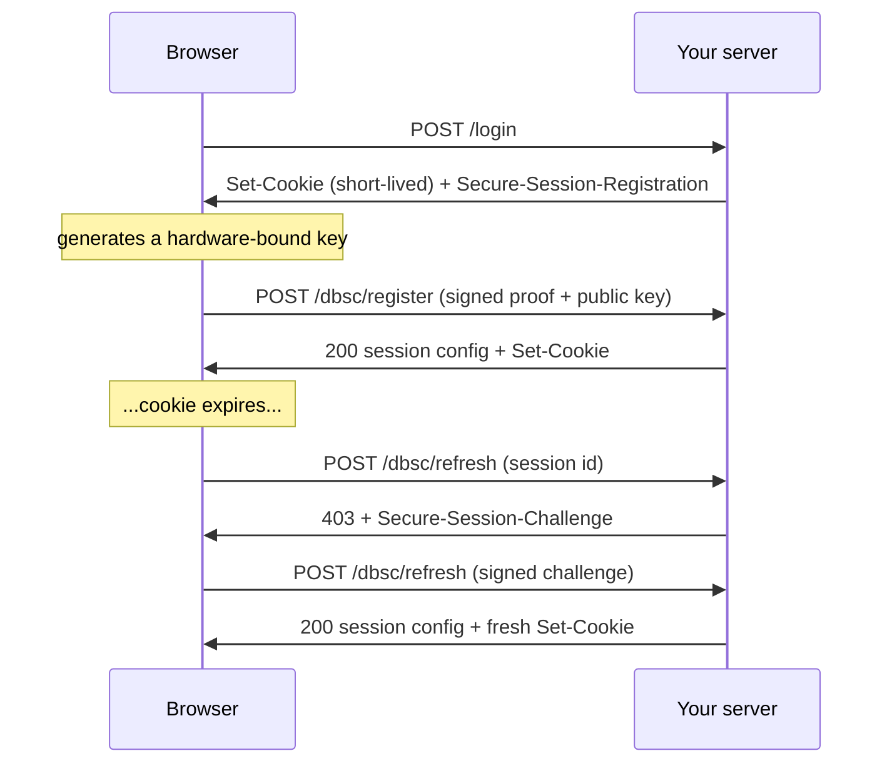

# dbsc-server

Server-side toolkit for Device Bound Session Credentials (DBSC).

[](https://github.com/CloudNua/dbsc-server/actions/workflows/ci.yml)
[](./LICENSE)


> **Status: pre-release.** The API can change until 1.0.0. Validated against
> real Chrome and against the shared cross-implementation test vectors.

## Why

Infostealer malware steals session cookies and replays them from another
machine. TLS, MFA, and passkeys do not stop this: the attacker skips sign-in
completely and uses the stolen session.

DBSC closes this gap. The browser creates a private key in secure hardware.
The key cannot leave the device. Your server hands out only short-lived
cookies. When a cookie expires, the browser proves possession of the device
key and gets a fresh cookie. A stolen cookie dies in minutes, and the thief
cannot refresh it, because the thief does not have the device key.

`dbsc-server` implements the server side of this protocol: the headers, the
challenges, the proof verification, and the refresh state machine. You keep
your own session system and your own cookies. Zero runtime dependencies.
Runs on Node.js, Bun, and Deno.

## How it works



## Install

```sh
npm install dbsc-server
```

## Quickstart

```js
import { createDbsc, createDbscHandlers, createMemoryStore } from 'dbsc-server';

const dbsc = createDbsc({ store: createMemoryStore(), challenge: { secret: process.env.DBSC_SECRET } });
const { register, refresh } = createDbscHandlers({
  dbsc,
  bindSession: () => ({
    scope: { includeSite: false },
    credentials: [{ name: 'session', attributes: 'Path=/; Secure; HttpOnly; SameSite=Lax' }],
    setCookies: [mintYourSessionCookie()], // short Max-Age; DBSC refreshes it
  }),
});
```

`register` and `refresh` are plain `(Request) => Promise<Response>` functions.
Route them at your two DBSC endpoints, and set the header from
`await dbsc.registrationHeader()` on your sign-in response. That is the whole
integration. See the [demo server](./demo/server.mjs) for a complete example in
one file.

## Framework adapters

| Framework | Import | Recipe |
|---|---|---|
| Express / node:http | `dbsc-server/express` | [recipe](./docs/recipes/express.md) |
| Hono | `dbsc-server/hono` | [recipe](./docs/recipes/hono.md) |
| Next.js (App Router) | `dbsc-server/next` | [recipe](./docs/recipes/next.md) |
| Elysia | `dbsc-server/elysia` | [recipe](./docs/recipes/elysia.md) |
| Fastify | `dbsc-server/fastify` | [recipe](./docs/recipes/fastify.md) |
| NestJS | `dbsc-server/nestjs` | [recipe](./docs/recipes/nestjs.md) |
| Auth.js | core | [recipe](./docs/recipes/authjs.md) |

The adapters are thin shims over one WHATWG handler layer. The package imports
no framework code.

## Documentation

- [Security model](./docs/security-model.md): what DBSC protects, what it does
  not, and the design decisions in this package.
- [Protocol gotchas](./docs/gotchas.md): the deployment mistakes that make
  DBSC silently do nothing, and how this package flags them.
- [Browser support](./docs/browser-support.md): where DBSC works today and how
  to degrade gracefully.
- [Test with real Chrome](./docs/chrome-testing.md): no TPM required.
- [Interoperability](./docs/interop.md): shared test vectors with other
  implementations.
- [Storage recipes](./docs/recipes/storage.md): Postgres/Drizzle and Redis
  store implementations to copy.

## Spec version

This package tracks the [W3C editor's draft](https://w3c.github.io/webappsec-dbsc/).

| Item | Value |
|---|---|
| Header names | Second origin trial (`Secure-Session-*`), the form GA Chrome ships |
| Legacy names | `Sec-Session-*` accepted on inbound requests (configurable) |
| Last validated | 2026-08-19, against Chrome with software keys |

## Contributing and security

Issues are welcome; the project does not accept unsolicited pull requests. See
[CONTRIBUTING.md](./CONTRIBUTING.md). Report vulnerabilities per
[SECURITY.md](./SECURITY.md); do not open a public issue.

## License

[MIT](./LICENSE)
