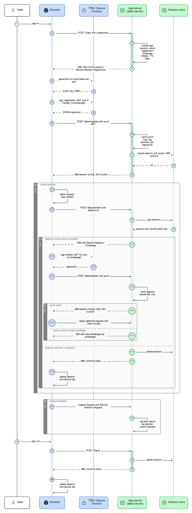

# End-to-end sequence diagram

The diagram shows one complete DBSC session lifecycle across five participants:
the user, the browser, the device's secure hardware (TPM or Secure Enclave),
an application server that uses this package, and the session store.

## How the steps map to this package

| Steps | Phase | Package surface |
|---|---|---|
| 1 to 4 | Sign-in. The server creates its app session, issues a registration challenge, and sends `Secure-Session-Registration` with the cookie. | `dbsc.registrationHeader()` |
| 5 to 8 | The browser generates a non-exportable key pair in secure hardware and signs the registration JWT (`jwk` in the header, `jti` = challenge). The private key never leaves the device. | Browser side; no package code |
| 9 to 13 | Registration. The server verifies the proof (typ, algorithm allowlist, key normalization, signature, challenge), stores the public JWK and its RFC 7638 `kid`, and returns the session configuration with a fresh cookie. | `dbsc.handleRegistration()`, `DbscSessionStore.create`, `dbsc.sessionConfigResponse()` |
| 14.x | The refresh loop. When the short-lived cookie expires, the browser defers the request and calls the refresh endpoint. Known session: 403 plus `Secure-Session-Challenge`, then the browser retries with a signed proof (no `jwk`; verified against the STORED key only). Valid proof: 200 plus a fresh cookie. Invalid or stale proof: a new 403 challenge, never termination. Unknown or expired session: 400 with `"continue": false`, and the browser deletes the session and key. | `dbsc.handleRefresh()` state machine |
| 15.x | Degraded path. The browser could not refresh (for example quota exceeded) and sends the request anyway with `Secure-Session-Skipped`. The server logs it and serves it as a normal expired-cookie request. | `dbsc.observeSkipped()` |
| 16 to 20 | Sign-out. The server deletes the session and answers `"continue": false`; the browser removes the session and the device key. | `dbsc.terminate()` |

## Reading notes

- Every response the app returns in steps 13 and 14.5.6.1 comes from
  `sessionConfigResponse()`, which also runs the deployment-invariant checks
  (see [gotchas](../gotchas.md)).
- The 403 in step 14.5.1 is the protocol working, not an error. Alert on 403s
  without a following 200, not on 403s.
- The diagram source is maintained as an Eraser diagram-as-code definition;
  regenerate the PNG from Eraser when the flow changes.
